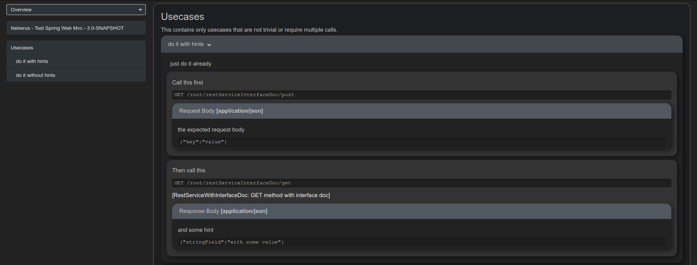

# Neberus REST Documentation

[](https://travis-ci.org/1and1/neberus)
[](https://maven-badges.herokuapp.com/maven-central/net.oneandone.neberus/neberus-doclet)

JavaDoc Doclet that automatically generates REST Documentation from your code!
Out of the box compatibility with javax.ws.rs and spring-webmvc (experimental).

- [Neberus REST Documentation](#neberus-rest-documentation)
	- [Setup](#setup)
		- [Maven](#maven)
			- [Using classes from dependencies](#using-classes-from-dependencies)
	- [Viewing the Apidocs](#viewing-the-apidocs)
	- [Service Documentation](#service-documentation)
	- [Method Documentation](#method-documentation)
		- [Annotations](#annotations)
		- [Example Usage](#example-usage)
		- [Example Usage with Interface](#example-usage-with-interface)
		- [Deprecated Methods](#deprecated-methods)
	- [Usecase Documentation](#usecase-documentation)
		- [Annotations](#annotations-1)
		- [Example](#example)
	- [Extensions](#extensions)

## Setup

### Java 8 vs. Java 11

Java 8 is only supported with version 1.x.

All newer versions require Java 11. 

### Maven

- Add a dependency to `neberus-doclet` to get access to Neberus' annotations in your code.
- Configure the maven-javadoc-plugin to use the Neberus doclet

`pom.xml`

```xml
<dependencies>
    ...
    <dependency>
        <groupId>net.oneandone.neberus</groupId>
        <artifactId>neberus-doclet</artifactId>
        <version>${neberus.version}</version>
    </dependency>
    ...
</dependencies>

 <build>
    <plugins>
        ...
        <plugin>
            <groupId>org.apache.maven.plugins</groupId>
            <artifactId>maven-javadoc-plugin</artifactId>
            <executions>
                <execution>
                    <id>generate-service-docs</id>
                    <phase>generate-resources</phase>
                    <configuration>
                        <doclet>net.oneandone.neberus.Neberus</doclet>
                        <docletArtifact>
                            <groupId>net.oneandone.neberus</groupId>
                            <artifactId>neberus-doclet</artifactId>
                            <version>${neberus.version}</version>
                        </docletArtifact>
                        <reportOutputDirectory>
                        <!-- recommended path for traditional '*.war' services -->
                        ${project.build.directory}/${project.build.finalName}
                        <!-- recommended path for spring boot '*.deb' services -->
                        ${project.build.directory}/classes/resources/
                        </reportOutputDirectory>
                        <useStandardDocletOptions>false</useStandardDocletOptions>
                        <additionalOptions><!-- ATTENTION: this has been renamed from 'additionalparam' with maven-javadoc-plugin version 3.0.0 -->
                            -apiVersion ${project.version}
                            -apiTitle "${project.name}"
                            -docBasePath .
                            -apiBasePath ${apiBasePath}
                            -apiHost http://yourhost.com <!-- the leading 'http://' can be omitted, but it must be provided for 'https://' -->
                            -scanPackages net.oneandone <!-- semicolon separated list of packages to be included -->
                        </additionalOptions>
                    </configuration>
                    <goals>
                        <goal>javadoc</goal>
                    </goals>
                </execution>
            </executions>
        </plugin>
        ...
    </plugins>
</build>

```

#### Using classes from dependencies

If classes from dependencies are used as entities of parameters or response values of some methods, it is required to include those dependencies in the configuration of the maven-javadoc-plugin.
Otherwise it is not possible to properly generate the templates for these classes.

More information about how the inclusion works can be found [here](https://maven.apache.org/plugins/maven-javadoc-plugin/examples/aggregate-dependency-sources.html).

## Viewing the Apidocs

Neberus generates only static `html` files and adds some `css` and `js` files. This means that the docs can be served from many places and viewed in any browser.

The apidocs can be deployed to an external server, accessed over the repository or included within the webapp.

## Service Documentation

If a `package.html` file is found in the same package as classes/interfaces annotated with `@ApiDocumentation`, the content of this file is included on the index site.

Headings should start with `h2`, since Neberus generates a `h1` heading with the service name.

## Method Documentation

REST methods can be documented either directly on the method or (recommended) in a seperate interface that is implemented by the class containing the methods.

Definitions in the REST-class will be used as fallback in case the interface does not provide sufficient Documentation.


### Annotations

| Name  | Description  |  Target |
|---|---|---|
| @ApiDocumentation | Enables neberus documentation for a class containing REST methods.  | Type |
| @ApiCurl | Generate an example curl. | Method |
| @ApiAllowedValues | Define the allowed values for a parameter. | Method, VariableElement, Field |
| @ApiDescription | If provided, the value of this will be used as description of the method instead of the javadoc comment. | Method, Type |
| @ApiHeader | Define a Header.<br>If defined within a @ApiResponse, it will represent a response header.<br>If defined on class level, this can be used to provied descriptions of headers that are reused many times. The header name will be used for reference. | Type |
| @ApiHeaders | Container annotation for @ApiHeader. | Type |
| @ApiLabel | Defines the name of a REST class or method. | Method, Type |
| @ApiParameter | Defines a custom parameter for a REST method. Most likely used to document fields inside the body. | Method |
| @ApiParameters | Container annotation for @ApiParameter. | Method |
| @ApiResponseValue | Defines a custom parameter for a REST method. Most likely used to document fields inside the body. | Method |
| @ApiResponseValues | Container annotation for @ApiResponseValue. | Method |
| @ApiSuccessResponse | Document a Success Response. | Method |
| @ApiSuccessResponses | Container annotation for @ApiSuccessResponse. | Method |
| @ApiWarningResponse | Document a Warning Response. The Content-Type will be set to "application/warnings+json". | Method |
| @ApiWarningResponses | Container annotation for @ApiWarningResponse. | Method |
| @ApiWarning | A single Warning used in @ApiWarningResponse. | - |
| @ApiProblemResponse | Document a Problem Response. The Content-Type will be set to "application/problem+json". | Method |
| @ApiProblemResponses | Container annotation for @ApiProblemResponse. | Method |
| @ApiResponse | Document a Response that does not fit into Success-, Warning-, or Problem-Response. | Method |
| @ApiResponses | Container annotation for @ApiResponse. | Method |
| @ApiType | Define the type that should be displayed instead of the actual type. This can be used to hide internal wrapper DTOs. | VariableElement |
| @ApiOptional | Declare a parameter as optional. | Method, VariableElement, Field |
| @ApiIgnore | Exclude a request parameter, DTO field or a whole REST method from documentation. | Method, VariableElement, Field |

### Example Usage

```java
/*
 * REST Class Documentation
 */
@ApiDocumentation
@Path("/rootPath")
@ApiLabel("Super Awesome REST Service")
@ApiHeader(name = "header1", description = "description1")
@ApiHeader(name = "header2", description = "description2")
public class RestService {

	/**
	 * ApiDescription of this awesomely awesome method defined as javadoc!
	*
	* @param dto the body
	*/
	@GET
	@Path("/anotherGet/{pathParam}/anotherPathParam/{anotherPathParam}")
	@Consumes(MediaType.APPLICATION_JSON)
	@Produces(MediaType.APPLICATION_JSON)
	@ApiLabel("This is an awesome method")
	@ApiDescription("Description of this awesomely awesome method defined in annotation!")
	@ApiSuccessResponse(status = ApiStatus.OK)
	@ApiProblemResponse(status = ApiStatus.OK,
		description = "this should be handled as error",
		type = ProblemType.EXPECTATION_FAILED,
		detail = "magic failed",
		title = "magic title")
	@ApiWarningResponse(status = ApiStatus.OK,
		description = "and this as warning",
		warnings = @ApiWarning(
			type = ProblemType.AUTHENTICATION_ERROR,
			title = "warning title"))
	@ApiSuccessResponse(status = ApiStatus.BAD_GATEWAY,
		description = "a bad thing happened",
		entityClass = SomeDto.class,
		contentType = "crazyCustomType",
		headers = {
			@ApiHeader(name = "123", description = "456"),
			@ApiHeader(name = "header2")
		})
	@ApiCurl
	public void justAnotherGetMethod(
		@PathParam("pathParam") @ApiAllowedValues("only this one") String pathParam,
		@PathParam("anotherPathParam") String anotherPathParam,
		@QueryParam("queryParam") String queryParam,
		SomeDto dto) {
	}

	public static class SomeDto {
		/**
		 * VariableElement can be placed here.
		 * {@link SomeEnum} <- this will place the enum values as 'allowed values'
		 * @see SomeEnum <- this will do the same
		 */
		public String string1;
		
		/**
		 * @see SomeWrapperClass#value <- can be used to reference the javax.validation constraints of another field
         */
		public String string2;

		/**
		 * If the fields are private, the doc can be placed on the getter
		 */
		public String getString1() {}

		/**
		 * @param string1 or it can be placed on the ctor if all fields are private and no getters are found
		 *                {@link SomeEnum} <- can also be used here
		 */
		public SomeDto(String string1) {}
	}
}
```

### Example Usage with Interface

```java
/*
 * REST Class Documentation
 */
@Path("/rootPath")
public class RestService implements RestDoc {

	/**
	 * Internal JavaDoc not visible in the ApiDocumentation because it is overwritten in the interface
         * @param pathParam this will be visible in the apidocs
	 */
	@GET
	@Path("/anotherGet/{pathParam}/anotherPathParam/{anotherPathParam}")
	@Consumes(MediaType.APPLICATION_JSON)
	@Produces(MediaType.APPLICATION_JSON)
	public void justAnotherGetMethod(
		@PathParam("pathParam") String pathParam,
		@PathParam("anotherPathParam") String anotherPathParam,
		@QueryParam("queryParam") String queryParam,
		SomeDto dto) {
	}
}


@ApiDocumentation
@ApiLabel("Super Awesome REST Service")
@ApiHeader(name = "header1", description = "description1")
@ApiHeader(name = "header2", description = "description2")
public interface RestDoc {

	/**
	 * ApiDescription of this awesomely awesome method defined as javadoc!
	 *
	 * @param dto the body
	 */
	@ApiLabel("This is an awesome method")
	@ApiSuccessResponse(status = ApiStatus.OK)
	@ApiProblemResponse(status = ApiStatus.OK,
		description = "this should be handled as error",
		type = ProblemType.EXPECTATION_FAILED,
		detail = "magic failed",
		title = "magic title")
	@ApiWarningResponse(status = ApiStatus.OK,
		description = "and this as warning",
		warnings = @ApiWarning(
			type = ProblemType.AUTHENTICATION_ERROR,
			title = "warning title"))
	@ApiSuccessResponse(status = ApiStatus.BAD_GATEWAY,
		description = "a bad thing happened",
		entityClass = SomeDto.class,
		contentType = "crazyCustomType",
		headers = {
			@ApiHeader(name = "123", description = "456"),
			@ApiHeader(name = "header2")
		})
	@ApiCurl
	void justAnotherGetMethod(@ApiAllowedValues("this one") String pathParam,
								String anotherPathParam,
								String queryParam,
								SomeDto dto);

}
```

### Deprecated Methods

Methods annotated with @Deprecated will be specially marked in the generated documentation and can provide links to other methods that shouls be used instead inside the @deprecated javadoc tag with @link tags.
The referenced method may be in the same class or in another documented class within the same project.

```java
/**
 * @deprecated use this one {@link #justYetAnotherGetMethod(java.lang.String, java.lang.String, net.oneandone.neberus.test.RestService.SomeDto)}
 */
@GET
@Path("/anotherGet/{pathParam}/anotherPathParam/{anotherPathParam}")
@ApiLabel("This is an awesome method")
@Consumes(MediaType.APPLICATION_JSON)
@Deprecated
public void justAnotherGetMethod(@PathParam("pathParam") @ApiAllowedValues("toast") String pathParam,
                                 @PathParam("anotherPathParam") String anotherPathParam,
                                 @QueryParam("queryParam") String queryParam,
                                 SomeDto dto) {
}

@GET
@Path("/anotherGet")
@ApiLabel("This is another awesome method")
@Consumes(MediaType.APPLICATION_FORM_URLENCODED)
public void justYetAnotherGetMethod(@PathParam("pathParam") @ApiAllowedValues("only this one") String pathParam,
                                    @QueryParam("queryParam") String queryParam,
                                    SomeDto dto) {
}
```

## Usecase Documentation

It is also possible to write documentation for usecases that span multiple methods or use already documented methods in a non-trivial way.

For this purpose a new dedicated `class` or `interface` should be defined that only contains the usecase documentation.

The generated documentation will be appended to the index page.



### Annotations

| Name  | Description  |  Target |
|---|---|---|
| @ApiUsecase | Defines a specific usecase of the REST service. Usecases must be defined in seperate classes or interfaces apart from the normal apidoc.<br>The javadoc of the defining class (must be placed above the annotations) will be used as introduction. | Type |
| @ApiUsecases | Container for multiple {@link ApiUsecase} annotations. | Type |
| @ApiUsecaseMethod | A specific REST method used in an usecase.<br>If the method is documented within the same service, it can be referenced by providing the restClass and name (label) of the method. In this case a link will be created and all parameters and responseValues will be cross-checked so they actually exist in the referenced method. | - |
| @ApiUsecaseParam | VariableElement used by a REST method in a usecase. If the method is linked to an actual REST method, the name must exist in the linked method. Use dot-syntax for nested parameters, eg. 'myDto.myField' | - |
| @ApiUsecaseResponseValue | ResponseValue returned by a REST method in a usecase. | - |

### Example

```java
/**
 * This javadoc has to be located ABOVE the annotations.
 * This contains only usecases that are not trivial or require multiple calls.
 */
@ApiUsecase(name = "do it", description = "just do it already",
            methods = {
                @ApiUsecaseMethod(
                        name = "This is an awesome method",
                        restClass = RestServiceWithInterfaceDoc.class,
                        description = "Call this first",
                        parameters = {
                            @ApiUsecaseParam(name = "pathParam123", value = "myId", valueHint = "the hint"),
                            @ApiUsecaseParam(name = "queryParam123", valueHint = "not my type hint")
                        }),
                @ApiUsecaseMethod(
                        name = "This is another awesome method",
                        restClass = RestServiceInterfaceDoc.class,
                        description = "Then call this",
                        responseValue = {
                            @ApiUsecaseResponseValue(name = "custom responseValue2", value = "with some value")
                        })
            })
@ApiUsecase(name = "do it", description = "just do it already",
            methods = {
                @ApiUsecaseMethod(
                        name = "This is an awesome method",
                        restClass = RestServiceWithInterfaceDoc.class,
                        description = "Call this first",
                        parameters = {
                            @ApiUsecaseParam(name = "pathParam123", value = "myId"),
                            @ApiUsecaseParam(name = "queryParam123", value = "not my type")
                        }),
                @ApiUsecaseMethod(
                        name = "This is another awesome method",
                        restClass = RestServiceInterfaceDoc.class,
                        description = "Then call this",
                        responseValue = {
                            @ApiUsecaseResponseValue(name = "custom responseValue2", value = "with some value")
                        })
            })
public class UsecaseDoc {

}
```

## Extensions

Neberus can be extended with modules and shortcodes. To include an extension it must be 
added to the `configuration` of the `maven-javadoc-plugin` as `resourcesArtifact`.

```xml
<plugin>
    <groupId>org.apache.maven.plugins</groupId>
    <artifactId>maven-javadoc-plugin</artifactId>
    <executions>
        <execution>
            <id>generate-service-docs</id>
            <phase>generate-resources</phase>
            <configuration>
                ...
                <resourcesArtifacts>
                    <resourcesArtifact>
                        <groupId>${your-extension-groupid}</groupId>
                        <artifactId>${your-extension-artifactid}</artifactId>
                        <version>${your-extension.version}</version>
                    </resourcesArtifact>
                </resourcesArtifacts>
            </configuration>
            ...
        </execution>
    </executions>
</plugin>

```